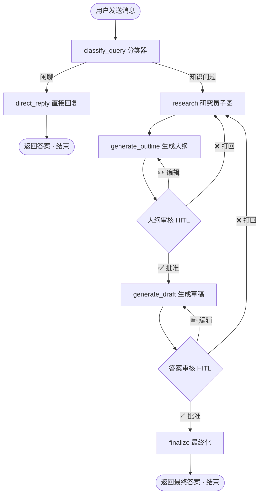
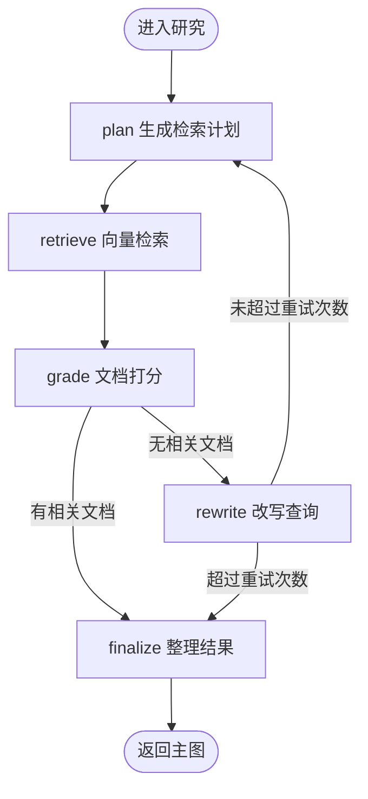
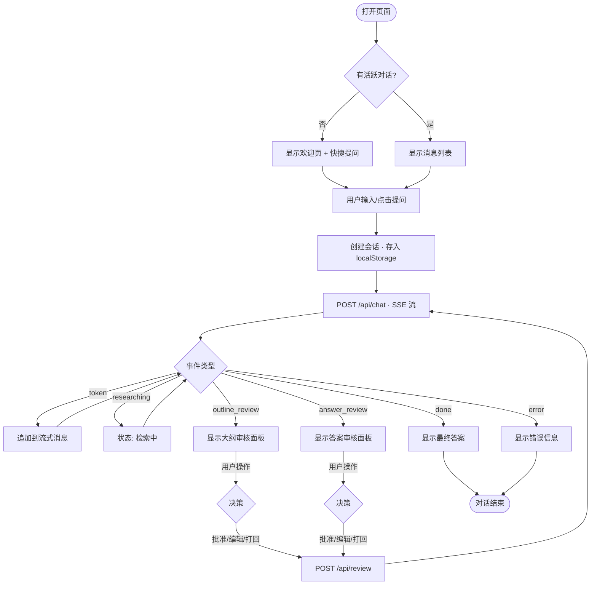

# 对话流程图

> 从用户发送消息到收到最终答案的完整流程。

## 整体流程



## 研究员子图（research 内部）



## 前端交互流程



## 状态流转

```
idle → researching → outline_review → generating → answer_review → done
                ↑          │                 ↑          │
                └──────────┘(打回)            └──────────┘(打回)
```

| 前端 phase | 对应节点 | 用户看到的 |
|------------|---------|-----------|
| idle | — | 欢迎页 |
| researching | classify_query → research | "正在检索相关知识库文档..." |
| outline_review | generate_outline (interrupt) | 大纲审核面板 |
| generating | generate_draft | "正在生成答案..." |
| answer_review | generate_draft (interrupt) | 答案审核面板 + 幻觉检测结果 |
| done | finalize | 最终答案 |
| error | — | 错误信息 |
